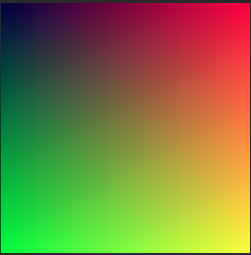

# 🎨 PPM Image Generator & Viewer
*A beginner-friendly cross-language project for computer graphics practice — Generate PPM gradient images with C language & View images via Python Pillow*

[](https://github.com/)
[](https://en.wikipedia.org/wiki/C_(programming_language))
[](https://www.python.org/)
[](https://pillow.readthedocs.io/)

## 📁 Project Structure
```
├── print_image.c    ➡️  Core code for PPM image generation (C)
├── show_image.py    ➡️  Image viewing script (Python)
├── screenshot.png   ➡️  Project effect preview
└── README.md        ➡️  Project documentation
```

---

## 🇺🇸 English Version
### 📖 Project Overview
This is an introductory programming project that **generates standard PPM format gradient images using C language**, and realizes image visualization through Python's Pillow library. It integrates basic programming, file operation and cross-language collaboration skills, which is highly suitable for computer graphics beginners and basic programming practice.

### 🛠️ Environment Preparation
1. **C Compiler**: Install GCC (MinGW for Windows, built-in for Mac/Linux)
2. **Python Environment**: Python 3.6 or higher version
3. **Python Dependency**: Install Pillow library for image processing
   ```bash
   pip install pillow
   ```

### 🚀 Operation Steps
#### Step 1: Compile & Generate PPM Image
1. Open terminal/command prompt, navigate to the project root directory
2. Compile the C source code to generate executable file
   ```bash
   # Windows
   gcc print_image.c -o image_generator.exe
   # Mac/Linux
   gcc print_image.c -o image_generator
   ```
3. Run the program and generate PPM image file via output redirection
   ```bash
   # Windows
   image_generator.exe > output.ppm
   # Mac/Linux
   ./image_generator > output.ppm
   ```
4. A file named `output.ppm` will be created in the project folder

#### Step 2: View the Generated Image
1. Make sure the file path in `show_image.py` is set to `output.ppm`
2. Run the Python script to display the image
   ```bash
   python show_image.py
   ```
3. The system will automatically open the default image viewer to show the gradient effect

### 📚 Knowledge Points Summary
1. **C Language Basics**: Master standard I/O library, double nested loops for 2D pixel traversal, data type conversion and color value normalization
2. **File Operation**: Learn to use command line output redirection `>` to save console output as a PPM image file
3. **Python Library Usage**: Skillfully use Pillow library to read and display image files
4. **Cross-Language Collaboration**: Understand the division of labor — C for underlying data generation, Python for upper-layer visualization
5. **PPM Image Format**: Master the header specification and RGB color storage rules of plain text PPM images

---

## 🇨🇳 中文版
### 📖 项目简介
这是一款入门级编程实战项目，通过**C语言生成标准PPM格式渐变图像**，并借助Python的Pillow库实现图像可视化展示，融合了编程基础、文件操作与跨语言协作技能，非常适合计算机图形学入门与编程基础练习。

### 🛠️ 环境准备
1. **C语言编译器**：安装GCC（Windows推荐MinGW，Mac/Linux系统自带）
2. **Python环境**：Python 3.6及以上版本
3. **Python依赖库**：安装图像处理库Pillow
   ```bash
   pip install pillow
   ```

### 🚀 运行步骤
#### 步骤1：编译并生成PPM图像
1. 打开终端/命令提示符，切换到项目根目录
2. 编译C语言源码，生成可执行文件
   ```bash
   # Windows系统
   gcc print_image.c -o image_generator.exe
   # Mac/Linux系统
   gcc print_image.c -o image_generator
   ```
3. 运行程序，通过输出重定向生成PPM图像文件
   ```bash
   # Windows系统
   image_generator.exe > output.ppm
   # Mac/Linux系统
   ./image_generator > output.ppm
   ```
4. 项目文件夹内会生成名为`output.ppm`的图像文件

#### 步骤2：显示生成的图像
1. 确认`show_image.py`文件中的图片路径为`output.ppm`
2. 运行Python脚本查看图像
   ```bash
   python show_image.py
   ```
3. 系统将自动调用默认图片查看器，展示渐变效果图像

### 📚 知识点总结
1. **C语言基础**：掌握标准输入输出库、双层循环遍历二维像素、数据类型转换、颜色值归一化计算
2. **文件操作**：学会使用命令行输出重定向符`>`，将控制台输出保存为PPM图像文件
3. **Python库使用**：熟练运用Pillow库实现图像文件的读取与显示
4. **跨语言协作**：理解C语言负责底层数据生成、Python负责上层可视化的分工逻辑
5. **PPM图像格式**：掌握纯文本PPM图像的文件头规范、RGB颜色值存储规则

---

## 🖼️ Effect Display


## 💡 Tips
- Ensure all files are in the **same directory** before running
- Check the file name consistency between C output and Python reading
- Suitable for resume project display, reflecting basic programming and engineering practice ability

